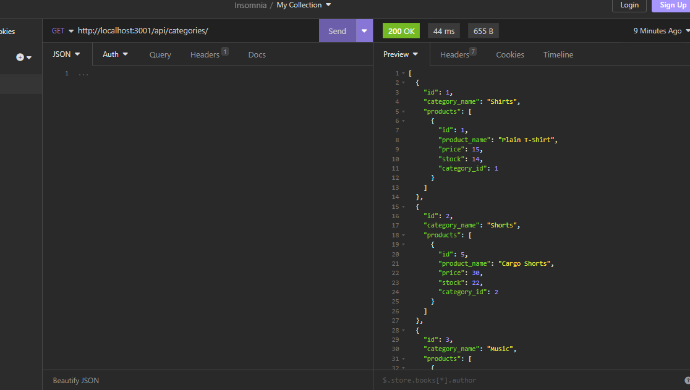

# Ecommerce-backend
First, I setup database models.
Then, I added the associations between models.
Then, I completed all the routes.
I can show how create the schema, seed the database, start the server, then demonstrate all the routes in Insomnia.
Link to video:
https://drive.google.com/file/d/151e1E-FFe-dmHsy85vchj_bRNkWjkB4s/view
Link to github repo:
https://github.com/cjmendenhall24/Ecommerce-backend